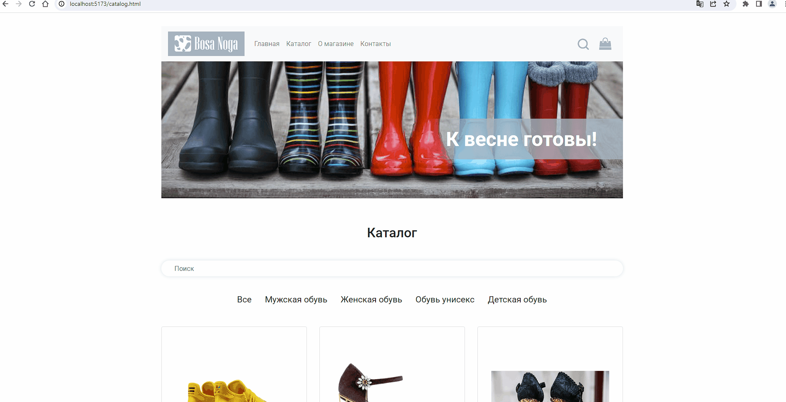

# Дипломный проект курса «React»

## Установка после клонирования репозитория

### backend

```
cd my-react-diplom
cd backend
npm install
npm start
```

### frontend

```
cd my-react-diplom
cd frontend
npm install
npm run dev
```

## Деплой


